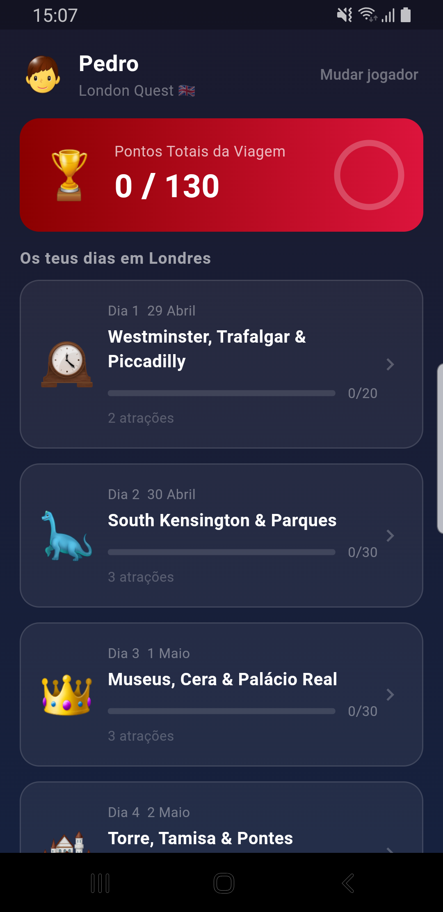
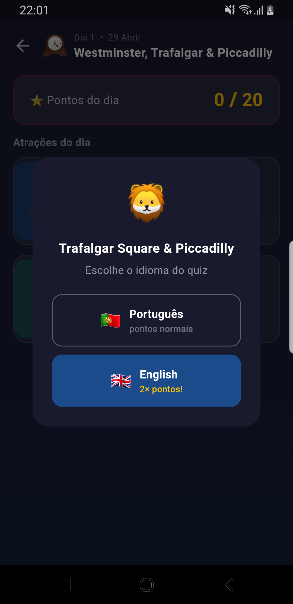

# 🇬🇧 London Quest

Quiz app for the Marto family London trip — May 2026.

Inês and Pedro answer questions about each landmark before visiting it.
Ana uses teach mode to prepare the explanations.

---

## Screenshots

<p align="center">
  
  
  
  
  
</p>

---

## Players

| Player | Mode |
|--------|------|
| 👧 Inês | Quiz (PT or EN) |
| 👦 Pedro | Quiz (PT or EN) |
| 👩 Ana | Teach mode + day score reset + bonus toggle |

---

## Features

- **4 days × 13 attractions** — 20 questions per attraction, 10 drawn randomly each session
- **Bonus round** — Coimbra (Day 5), unlocked by Ana for Inês & Pedro when ready
- **Bilingual quiz** — Portuguese (normal points) or English (2× points)
- **Timer** — 20 s per question (PT) or 30 s (EN), with animated progress bar
- Answer options shuffled randomly on every question
- Per-player best score saved locally (SharedPreferences)
- Retake any quiz — only improves score, never lowers it
- Fun fact revealed after each answer
- Attraction photo loaded from Wikimedia Commons
- Ana's teach mode: all 20 questions with correct answers + explanations
- Ana can reset day scores for Pedro or Inês individually
- Ana controls bonus round visibility via 🎓🔓 / 🎓🔒 toggle

---

## Trip Itinerary

| Day | Date | Attractions |
|-----|------|-------------|
| 1 | 29 Apr | Westminster & Big Ben, Trafalgar Square & Piccadilly |
| 2 | 30 Apr | Natural History Museum, Hyde Park, Science Museum |
| 3 | 1 May | British Museum, Madame Tussauds, Buckingham Palace |
| 4 | 2 May | Tower of London, Tower Bridge, HMS Belfast, St Paul's, Millennium Bridge |
| 🎓 | Bónus | Coimbra — Cidade dos Estudantes |

---

## Tech Stack

- Flutter (Dart) — Android & iOS
- `shared_preferences` — local score persistence
- `package_info_plus` — build version display (auto-synced with git tag)
- Wikimedia Commons — attraction images
- GitHub Actions — CI/CD: test → build APK + IPA → GitHub Release on tag

---

## CI/CD

Every push to `main`:
1. `flutter analyze` + `flutter test` (coverage ≥ 60%)
2. Integration tests on Android emulator
3. `flutter build apk --release` (Ubuntu)
4. `flutter build ipa --no-codesign` (macOS)

On `v*` tag push:
- Version in `pubspec.yaml` automatically set from tag name before build
- GitHub Release created automatically
- APK + IPA attached to the release

---

## Build locally

```bash
flutter pub get
flutter run           # debug
flutter build apk --release          # Android
flutter build ipa --no-codesign      # iOS (no signing)
```

APK: `build/app/outputs/flutter-apk/app-release.apk`
